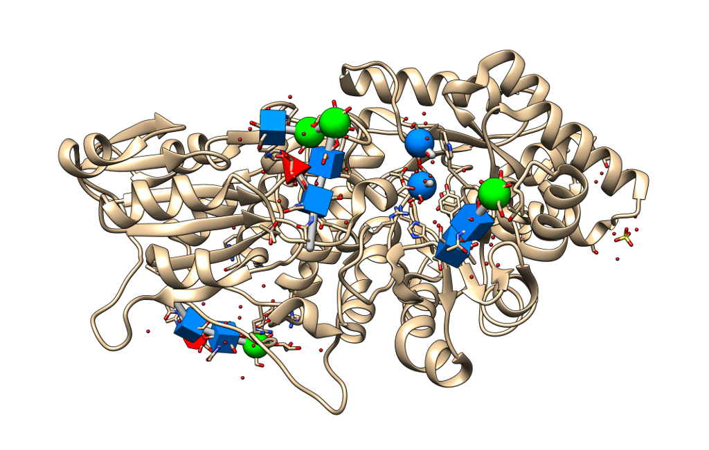

# 3D SNFG representation for UCSF Chimera

Based on [3D-SNFG.tcl](http://glycam.org/3d-snfg), by David F. Thieker and Jodi A. Hadden.

Original publication:

    3D Implementation of the Symbol Nomenclature for Graphical Representation of Glycans
    D.F. Thieker, J.A. Hadden, K. Schulten, and R.J. Woods
    Glycobiology, 2016

Help of Oliver Grant is kindly acknowledged.

# Installation and usage

Refer to the Tangram Suite documentation for further details. In particular:

- [How to install the full suite](http://tangram-suite.readthedocs.io/en/latest/install.html)
- [Installing only one extension](http://tangram-suite.readthedocs.io/en/latest/install.html#install-only-one-specific-extension)

# Support

Feel free to [create an issue](https://github.com/insilichem/tangram_snfg/issues) in this repository.
